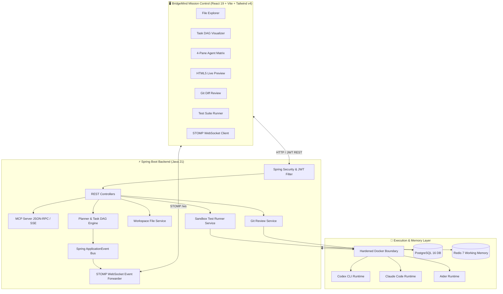

<div align="center">

# 🧠 BridgeMind
### The Autonomous Development Environment (ADE) & Multi-Agent Swarm Orchestrator

[](https://openjdk.org/)
[](https://spring.io/projects/spring-boot)
[](https://react.dev/)
[](https://www.typescriptlang.org/)
[](https://vitejs.dev/)
[](https://tailwindcss.com/)
[](https://www.postgresql.org/)
[](https://redis.io/)
[](https://www.docker.com/)
[](https://modelcontextprotocol.io/)
[](LICENSE)

<p align="center">
  <b>BridgeMind is an Autonomous Development Environment (ADE) designed for human engineering leads to orchestrate, supervise, and collaborate with autonomous AI coding swarms in secure, isolated sandboxes.</b>
</p>

[✨ Live Features](#-core-capabilities--features) •
[🏛️ Architecture](#-system-architecture) •
[⚡ Quickstart](#-getting-started) •
[🔌 MCP Integration](#-model-context-protocol-mcp-server) •
[🧪 Test Suite](#-automated-sandbox-test-runner) •
[📡 API Reference](#-complete-api-reference)

</div>

---

## 🌟 Vision & Overview

Traditional AI coding assistants act as single-turn chat wrappers or host-level autocomplete tools. **BridgeMind** reimagines software creation as a multi-agent engineering organization:

1. **Human Lead Input**: A developer or product manager specifies a high-level **Mission** (e.g., *"Scaffold a resilient Java microservice with JWT authentication and audit logging"*).
2. **DAG Decomposition**: The **Coordinator Engine** decomposes the mission into a deterministic Directed Acyclic Graph (DAG) of dependent subtasks (`Architecture` $\rightarrow$ `Backend` $\rightarrow$ `Frontend` $\rightarrow$ `DevOps` $\rightarrow$ `Security Review`).
3. **Multi-Agent Swarm Execution**: Specialized role-based agents (`COORDINATOR`, `BUILDER`, `SCOUT`, `REVIEWER`) execute their tasks concurrently inside isolated Docker sandboxes.
4. **Human-in-the-Loop Flight Deck**: Real-time STOMP WebSocket telemetry streams live terminal output, file explorer updates, Git diffs, test suite executions, and interactive HTML5 live previews with 1-click commit approval.

---

## ✨ Core Capabilities & Features

### 1. 🗂️ Interactive File Explorer (`BridgeSpace`)
* **Recursive Hierarchy**: Dynamic folder navigation, file search filtering, and extension-specific syntax icons.
* **In-Browser Code Editor**: Line-numbered code editor with instant file save, syntax highlights, and active tab state.
* **Filesystem Isolation**: Strictly enforces path-traversal prevention (`startsWith(workspaceRoot)`), symlink rejection, and atomic write operations.

### 2. 🐝 Swarm Topology & Task DAG Visualizer (`BridgeSwarm`)
* **Deterministic Flow**: Visualizes task lifecycles:
  $$\text{Coordinator} \longrightarrow \text{Builder} \longrightarrow \text{Scout} \longrightarrow \text{Reviewer}$$
* **Real-time Status Sync**: Color-coded state badges (`QUEUED`, `RUNNING`, `COMPLETED`, `FAILED`) dynamically updated over STOMP WebSockets without page reload.

### 3. 🌐 Model Context Protocol (MCP) Server (`BridgeMCP`)
* Fully compliant with the Anthropic **Model Context Protocol (MCP)** specification.
* External AI coding agents (such as **Cursor**, **Claude Code**, **OpenAI Codex CLI**, and **Cline**) can connect directly into BridgeMind workspaces over JSON-RPC 2.0 (`/api/mcp`) and Server-Sent Events (`/api/mcp/sse`).
* **Available MCP Tools**:
  * `read_workspace_file`: Reads UTF-8 file content with security path checks.
  * `list_workspace_files`: Recursively enumerates project structures.
  * `save_workspace_file`: Directly creates or modifies files in the workspace.
  * `get_workspace_git_diff`: Retrieves real-time uncommitted agent changes.
  * `approve_workspace_git_diff`: Human-in-the-loop commit approval via MCP.

### 4. 🧪 Automated Sandbox Test Runner (`BridgeTest`)
* **Framework Auto-Detection**: Automatically identifies project test suites (`Node.js/Vitest/Jest`, `Java/JUnit 5`, `Python/PyTest`).
* **Sandbox Execution**: Runs tests with strict resource and 60-second timeout constraints.
* **Live Telemetry Streaming**: Streams execution output, duration timers, and test results (`PASSED`, `FAILED`, `ERROR`) to the **🧪 Test Suite** tab in the right flight deck.

### 5. 🌿 Git Review & Human-in-the-Loop (`BridgeBoard`)
* **Unified Diff Viewer**: Side-by-side or unified Git head diffs with addition (`+` emerald) and deletion (`-` rose) syntax highlighting.
* **1-Click Commit Gate**: Approves, merges, and creates signed Git commits from agent workspace changes.

### 6. 🎮 Real-Time HTML5 Canvas Live Preview Engine
* Sandboxed iframe engine rendering live playable web apps, canvas games, and UI components synthesized by the swarm.
* **Viewport Switcher**: Instant switching between **Desktop (100%)**, **Tablet (768px)**, and **Mobile (375px)**.

### 7. 🛡️ Enterprise Security & Multi-Tenant Authentication
* **Spring Security & JWT**: Stateless HMAC-SHA256 token verification and BCrypt password encryption.
* **Bounded Concurrency**: Bounded `ThreadPoolTaskExecutor` preventing thread leaks and resource exhaustion under streaming loads.

---

## 🏛️ System Architecture



---

## 🚀 Getting Started

### 📋 Prerequisites
* **Java 21** or **Java 17 JDK**
* **Node.js 20+** & **npm**
* **Docker Desktop** (for PostgreSQL, Redis, and Sandbox execution)
* **Maven 3.9+**

### 1️⃣ Clone the Repository
```bash
git clone https://github.com/1himanshu1804442/BridgeMind.git
cd BridgeMind
```

### 2️⃣ Start Infrastructure (PostgreSQL & Redis)
```bash
cd infrastructure
docker compose up -d
cd ..
```
* **PostgreSQL**: `localhost:5433` (`bridgemind` / `bridgemind`)
* **Redis**: `localhost:6379`

### 3️⃣ Launch Backend (Spring Boot)
```bash
cd backend
mvn spring-boot:run
```
Backend starts on **`http://localhost:8080`**.

### 4️⃣ Launch Frontend (Vite React)
```bash
cd frontend
npm install
npm run dev
```
Frontend starts on **`http://localhost:5173`**.

---

## 🔌 Model Context Protocol (MCP) Server

BridgeMind exposes an open-standard MCP server. Any MCP client can integrate by pointing to:

* **Endpoint**: `http://localhost:8080/api/mcp`
* **SSE Stream**: `http://localhost:8080/api/mcp/sse`

### Example `cursor.json` / `claude_desktop_config.json`:
```json
{
  "mcpServers": {
    "bridgemind": {
      "url": "http://localhost:8080/api/mcp/sse",
      "transport": "sse"
    }
  }
}
```

### Supported Tools:
| Tool Name | Parameters | Description |
|---|---|---|
| `read_workspace_file` | `workspaceId`, `path` | Reads file content with security path checks |
| `list_workspace_files` | `workspaceId` | Recursively returns file and directory nodes |
| `save_workspace_file` | `workspaceId`, `path`, `content` | Writes/modifies files in the workspace |
| `get_workspace_git_diff` | `workspaceId` | Retrieves uncommitted changes |
| `approve_workspace_git_diff` | `workspaceId`, `message` | Commits approved diffs |

---

## 🧪 Automated Sandbox Test Runner

BridgeMind includes an automated sandbox test execution engine:
* **Trigger via UI**: Switch to the **🧪 Test Suite** tab in the right panel and click **"Run Test Suite"**.
* **Trigger via API**: `POST /api/workspaces/{workspaceId}/tests/run`
* **Real-time Streaming**: Results stream directly over the `/topic/workspace/{workspaceId}/tests` STOMP channel.

---

## 📡 Complete API Reference

### 🔐 Authentication (`/api/auth`)
| Method | Endpoint | Description |
|---|---|---|
| `POST` | `/api/auth/register` | Register user & receive JWT token |
| `POST` | `/api/auth/login` | Authenticate user & receive JWT token |

### 🏢 Workspaces (`/api/workspaces`)
| Method | Endpoint | Description |
|---|---|---|
| `GET` | `/api/workspaces` | List all workspaces |
| `POST` | `/api/workspaces` | Create new workspace |
| `GET` | `/api/workspaces/{id}` | Get workspace details |
| `DELETE` | `/api/workspaces/{id}` | Delete workspace & cascade tasks |
| `GET` | `/api/workspaces/{id}/files` | Recursively list workspace files |
| `GET` | `/api/workspaces/{id}/files/content?path={p}` | Read file content |
| `PUT` | `/api/workspaces/{id}/files/content` | Save file content |
| `GET` | `/api/workspaces/{id}/review/diff` | Get uncommitted Git diff |
| `POST` | `/api/workspaces/{id}/review/approve` | Approve & commit Git diff |
| `POST` | `/api/workspaces/{id}/tests/run` | Execute sandbox test suite |
| `GET` | `/api/workspaces/{id}/tests/latest` | Retrieve latest test run |
| `GET` | `/api/workspaces/{id}/timeline` | Retrieve workspace event audit timeline |
| `GET` | `/api/workspaces/{id}/preview/**` | Serve live playable application preview |

### 🎯 Missions & Tasks (`/api/missions`)
| Method | Endpoint | Description |
|---|---|---|
| `GET` | `/api/workspaces/{id}/missions` | List missions for workspace |
| `POST` | `/api/workspaces/{id}/missions` | Create mission & launch agent swarm |
| `GET` | `/api/missions/{missionId}/tasks` | Get mission task DAG nodes & status |
| `GET` | `/api/missions/{missionId}/agents` | List agents assigned to mission |

### 🌐 Model Context Protocol (`/api/mcp`)
| Method | Endpoint | Description |
|---|---|---|
| `POST` | `/api/mcp` | Standard JSON-RPC 2.0 MCP endpoint |
| `GET` | `/api/mcp/sse` | Streamable Server-Sent Events (SSE) stream |
| `GET` | `/api/mcp/info` | MCP Server discovery & capabilities |

### ⚡ WebSocket STOMP Channels (`/ws`)
| Channel | Destination | Description |
|---|---|---|
| **Mission Events** | `/topic/workspace/{workspaceId}/missions` | Mission created, status changed, finished |
| **Agent Events** | `/topic/mission/{missionId}/agents` | Agent output deltas, status transitions |
| **Test Events** | `/topic/workspace/{workspaceId}/tests` | Live test execution start and completions |
| **Runtime Events** | `/topic/workspace/{workspaceId}/runtimes` | Docker container execution events |

---

## 🧪 Testing & Quality Assurance

### Run Backend Tests (JUnit 5, Mockito, Security, MCP):
```bash
cd backend
mvn clean test
```

### Run Frontend Tests (Vitest, React Testing Library):
```bash
cd frontend
npm test -- --run
```

### Run Frontend Production Build:
```bash
cd frontend
npm run build
```

---

## 📂 Project Structure

```
BridgeMind/
├── backend/                       # Java 21 Spring Boot REST & WebSocket Service
│   ├── src/main/java/com/bridgemind/backend/
│   │   ├── agent/                 # Agent Entity, CRUD, Roles & Lifecycle Status
│   │   ├── config/                # Async ThreadPool, WebSocket STOMP, CORS, Exception Handling
│   │   ├── event/                 # Spring ApplicationEvents (Mission, Agent, Test)
│   │   ├── execution/             # Docker Sandbox Runner & Filesystem Isolation
│   │   ├── mcp/                   # Model Context Protocol (MCP) JSON-RPC & SSE Server
│   │   ├── memory/                # Redis Working Memory & Postgres Persistence
│   │   ├── mission/               # Mission Entity, Planner & Status State Machine
│   │   ├── review/                # Git Diff Generation & Human-in-the-Loop Approval
│   │   ├── runtime/               # External Runtimes (Codex, Claude Code, Aider)
│   │   ├── security/              # JWT Token Service, BCrypt, Security Filter Chain
│   │   ├── task/                  # Task DAG Entity, Scheduling & Concurrency Locks
│   │   ├── test/                  # Automated Sandbox Test Suite Runner Service
│   │   ├── timeline/              # Audit Log & Timeline Persistence
│   │   └── workspace/             # Workspace & File Explorer REST Endpoints
│   └── src/test/java/             # Unit & Integration Tests (100% Pass Rate)
├── frontend/                      # React 19 + Vite + TypeScript Studio
│   ├── src/
│   │   ├── features/workspace/components/
│   │   │   ├── AgentGrid.tsx      # 4-Pane Interactive Terminal Multiplexer
│   │   │   ├── FileEditor.tsx     # In-browser Code Editor with Line Numbers
│   │   │   ├── FileExplorer.tsx   # Recursive Workspace File Tree
│   │   │   ├── GitDiffReview.tsx  # Color-Coded Git Diff Viewer & Commit Action
│   │   │   ├── LivePreview.tsx    # HTML5 Canvas Sandboxed Playable Engine
│   │   │   ├── Sidebar.tsx        # Navigation Icon Rail
│   │   │   ├── TaskDagVisualizer.tsx # Swarm Topology DAG Bar
│   │   │   ├── TestRunnerPanel.tsx# Sandbox Test Execution Panel
│   │   │   ├── Timeline.tsx       # Real-time Event Stream Audit Log
│   │   │   └── WorkspaceLayout.tsx# Studio Flight Deck Layout & State
│   │   ├── hooks/                 # React Query & STOMP WebSocket Hooks
│   │   ├── services/api.ts        # Typed REST Client with JWT Auth
│   │   ├── store/                 # Zustand Global Workspace Store
│   │   └── types/                 # TypeScript DTO & Domain Interfaces
│   └── src/__tests__/             # Vitest Component & Integration Tests
├── infrastructure/                # Docker Compose (PostgreSQL 16 & Redis 7)
├── docs/                          # Comprehensive Architectural & Technical Documentation
└── agent.md                       # Non-negotiable Architecture Rules & Constraints
```

---

## 📄 License

This project is licensed under the [MIT License](LICENSE).

<div align="center">
  <b>Built with ❤️ for the future of Autonomous Multi-Agent Software Engineering.</b>
</div>
