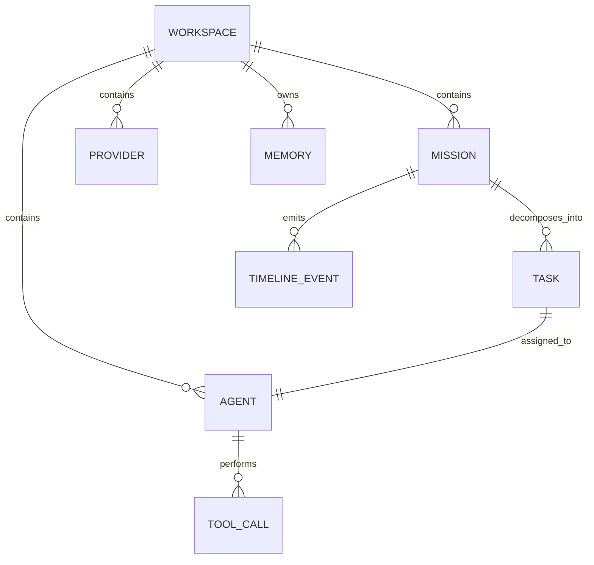
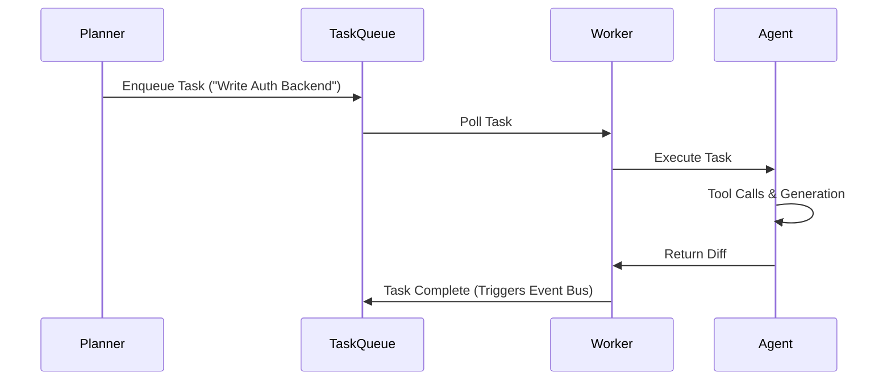
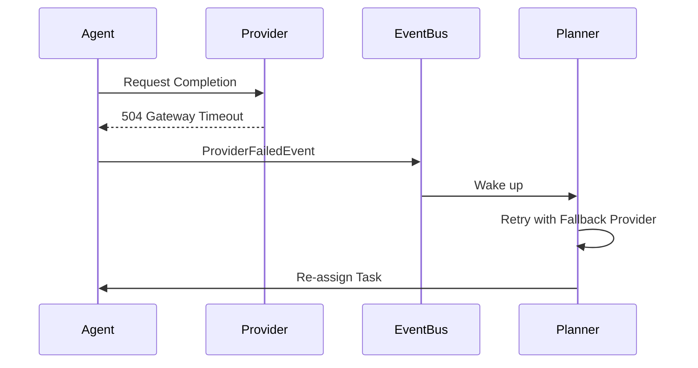

# 🏗️ Architecture: BridgeMind Workspace OS

## 1. Project Overview
BridgeMind is an Agent Development Environment (ADE). It acts as the Operating System for AI software development. The user acts as an Engineering Manager, delegating to a team of specialized AI Agents. 

## 2. Key Patterns & Tech Stack
- **Architecture Style:** Modular Event-Driven Architecture (EDA), CQRS, Isolated Workspace Sandboxing.
- **Frontend:** React, TypeScript, Vite, Tailwind CSS, shadcn/ui, React Query, Zustand.
- **Backend Core:** Java 21, Spring Boot 3 (Security, WebSockets, Events).
- **Memory Subsystem:** PostgreSQL + `pgvector` (Long Memory), Redis (Working Memory / TTL).
- **Execution Engine:** Docker Containers (Sandboxed Tool Execution).

---

## 3. The Domain Model (ER Diagram)
The core object hierarchy defining the state of the OS.


*Crucial Shift:* `Mission` → `Planner` → `Task` → `Agent` → `Provider` → `Tools`.

---

## 4. Lifecycles & State Management

### 4.1 Workspace State
`ACTIVE` ➔ `PAUSED` ➔ `ARCHIVED` ➔ `DELETED`

### 4.2 Mission Lifecycle
`CREATED` ➔ `PLANNING` ➔ `RUNNING` ➔ `REVIEW` ➔ `MERGING` ➔ `DONE`

### 4.3 Agent Lifecycle
`CREATED` ➔ `WAITING` ➔ `RUNNING` ➔ `THINKING` ➔ `CALLING_TOOL` ➔ `WAITING_FOR_TOOL` ➔ `GENERATING_DIFF` ➔ `REVIEW_PENDING` ➔ `COMPLETED` ➔ (or `FAILED`)

---

## 5. The Event Bus Dictionary
All asynchronous orchestration happens via Spring ApplicationEvents.
- `MissionCreated`, `MissionStarted`, `MissionCompleted`, `MissionFailed`
- `AgentSpawned`, `AgentPaused`, `AgentStopped`, `AgentCompleted`
- `ToolStarted`, `ToolCompleted`, `ToolFailed`
- `ProviderFailed`
- `TimelineUpdated`

---

## 6. Project Structure (Tree Map)
To ensure AI agents and human engineers can navigate the codebase flawlessly:
```text
backend/
 ├─ controller/     # HTTP / WebSocket endpoints (No business logic)
 ├─ service/        # Core business logic
 ├─ repository/     # Postgres / JPA access
 ├─ provider/       # API integrations (Gemini, Claude)
 ├─ planner/        # DAG parsing and Task decomposition
 ├─ mission/        # Mission lifecycle management
 ├─ agent/          # Agent behavior and prompt assembly
 ├─ tools/          # Tool Registry (Git, Fs, Docker)
 ├─ execution/      # Task Queue & Worker threads
 ├─ events/         # Event Bus definitions
 └─ websocket/      # STOMP / Real-time streaming

frontend/
 ├─ components/     # Reusable UI (shadcn)
 ├─ features/       # Domain-specific components
 ├─ hooks/          # Complex React logic
 ├─ services/       # API calls (React Query)
 ├─ store/          # Global state (Zustand)
 ├─ pages/          # Routing entry points
 └─ types/          # Strict TypeScript interfaces
```

---

## 7. Memory & The Provider Matrix

### 7.1 Memory Invalidation
- **Working Memory (Redis):** Strict TTL (Time-to-Live). Used for transient scratchpads and WebSocket broadcasting.
- **Long Memory (Postgres + pgvector):** Persistent RAG embeddings for project-wide context.

### 7.2 Capability Matrix
Agents use this matrix to route Tasks to the correct Provider natively.

| Provider | Streaming | Tools | Vision | Thinking | Reasoning |
| :--- | :--- | :--- | :--- | :--- | :--- |
| **Claude** | ✅ | ✅ | ✅ | ✅ | ❌ |
| **Gemini** | ✅ | ✅ | ✅ | ✅ | ✅ |
| **Groq** | ✅ | Limited| ❌ | Depends| ❌ |
| **Ollama** | Depends | Depends| Depends| Depends| Depends|

---

## 8. Planners & Tools

### 8.1 The Planner
- **DOES:** Create Tasks, Resolve Dependencies, Retry Failed Agents, Spawn Reviewer, Emit Events.
- **DOES NOT:** Write Files, Execute Shell Commands, Talk directly to Providers.

### 8.2 Tool Registry
- `GitTool`, `FilesystemTool`, `DockerTool`, `BrowserTool`, `SearchTool`, `MCPTool`.
- All tools execute inside the isolated Docker Container, never on the host.

---

## 9. Runtime Views

### 9.1 The Task Queue (Happy Path)


### 9.2 The Failure Path


---

## 10. UI Structure (Mission Control)
The frontend enforces structure:
`Workspace` ➔ `Mission Bar` ➔ `Agent Grid` ➔ `Timeline` ➔ `Memory Inspector` ➔ `Git Diff` ➔ `Logs`
